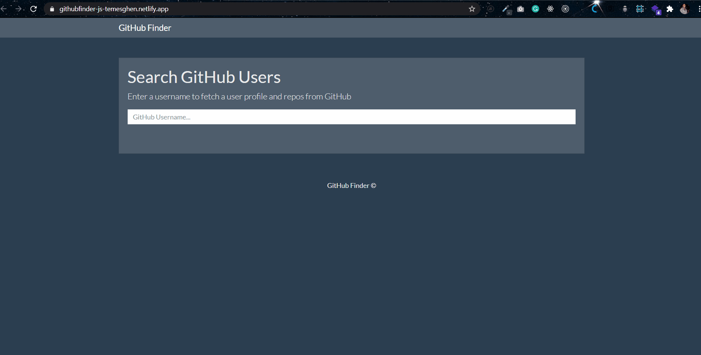
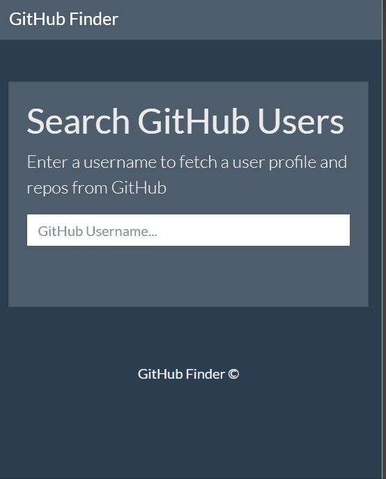

# GitHub Finder

## Content

<a text-align="center" href="#about">About</a>&nbsp;&nbsp;&nbsp;|&nbsp;&nbsp;&nbsp;
<a href="#live">Live Demo</a>&nbsp;&nbsp;&nbsp;|&nbsp;&nbsp;&nbsp;
<a href="#screenshots">Screenshots</a>&nbsp;&nbsp;&nbsp;|&nbsp;&nbsp;&nbsp;
<a href="#with">Built with</a>&nbsp;&nbsp;&nbsp;|&nbsp;&nbsp;&nbsp;
<a href="#setup">Setup</a>&nbsp;&nbsp;&nbsp;|&nbsp;&nbsp;&nbsp;
<a href="#prerequisites">Prerequisites</a>&nbsp;&nbsp;&nbsp;|&nbsp;&nbsp;&nbsp;
<a href="#enhancement">Enhancements</a>&nbsp;&nbsp;&nbsp;|&nbsp;&nbsp;&nbsp;
<a href="#author">Author</a>

## About 

GitHub Finder is a project intended to showcase such asynchrounous JavaScript programming skills as API calls using async and await keywords and promises. The project utilizes GitHub api to fetch the profile information and latest repos of a particular GitHub user account.
In nutshell, the project allows a user to:
<li>Search by GitHub username</li>
<li>Fetch the profile info</li>
<li>List the latest 5 repos of the GitHub user</li>

## 🔴 Live Demo 

**Click [here](https://githubfinder-js-temesghen.netlify.app/) in order to see a Live Demo of this project.**

## Screenshots 

### Wide Screen
 
### Small Screen
 

## 🔧 Built with

- HTML
- Bootstrap
- Vanilla JavaScript
- ES6/ES7/ES8
- ESLint

## 🔨 Setup
### Run a Local Copy
- Download the repository to a local directory on your computer.
- Or run the following commands on the terminal
  - git clone https://github.com/temesghentekeste/github-finder-js.git
  - cd github-finder-js
  - open index.html file

## Prerequisites
- A modern up-to-date browser

## Future Enhancement
- Front-end implementation using React or Angular
- Back-end implementation using Node JS
- Testing using one of available JS Testing frameworks/libraries
- Make GitHub API calls using the recommended approach

## ✒️  Author 

👤 **Temesghen Tekeste**

- Github: [@temesghentekeste](https://github.com/temesghentekeste)
- Twitter: [@temesghentekes1](https://twitter.com/temesghentekes1)
- Linkedin: [temsghen tekeste](https://www.linkedin.com/in/temesghentekeste/)

## 🤝 Contributing

Contributions, issues and feature requests are welcome!

Feel free to check the [issues page](https://github.com/temesghentekeste/github-finder-js/issues).

## 👍 Show your support

Give a ⭐️ if you like this project!

## :clap: Acknowledgements
- <a href="https://www.udemy.com/course/modern-javascript-from-the-beginning/" target="_blank">Modern JavaScript From The Beginning</a>
- <a href="https://www.microverse.org/" target="_blank">microverse.org</a>

